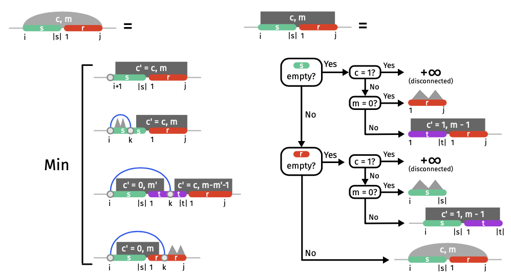

# RNA_Triplets

---

We aim at providing a C++ implementation of a dynamic programming scheme for the Strand soup Interaction model. This model is found in the following paper : 

**RNA Triplet Repeats: Improved Algorithms for Structure Prediction and Interactions**  
Kimon Boehmer1, Sarah J. Berkemer1,2, Sebastian Will1, Yann Ponty1


---

## Project Overview

This project implements the Nussinov algorithm and extends it to the Strand Soup Interaction model for RNA secondary structure prediction.

___


## Nussinov algorithm

This algorithm aims at predicting the secondary structure of a single RNA strand. It does so by finding the optimal base-pairing that maximizes the number of base pairs in a sequence.

### The problem

Given an RNA sequence S of length n. The goal is to find the structure that maximizes the number of base pairs.
It is represented via a Matrix M[i,j] :
- i and j represent indices of bases in the RNA sequence
- M[i,j] is the maximum number of base pairs in the sequence S[i,j]

### Solving

We use a dynamic programming approach. It is composed of two main functions :

1. **Filling the Minimum Energy Matrix**  
   Computes the minimum energy matrix using dynamic programming.

2. **Backtracking for the Minimum Energy Structure**  
   Extracts the optimal RNA secondary structure by tracing back through the computed matrix.


### Function 1 : Filling the minimum energy matrix

#### **Input**: 
- `ω` – RNA of size n

#### **Output**:
- `m` – Minimum energy matrix m

``` 
    Fonction FillMatrix (ω):
        m ← EmptyMatrix(n × n)
        ## Initialize with 0 all the values of the diagonal up to θ.
        for i ← 1 to n do
            for j ← i to min(i + θ, n) do
                mᵢ,ⱼ ← 0
        for i ← n to 1 do
            for j ← i + θ + 1 to n do
                Case A: Position i left without partner
                    mᵢ,ⱼ ← mᵢ₊₁,ⱼ
                Case B: Positions i and j form a base pair
                    mᵢ,ⱼ ← min(mᵢ,ⱼ, mᵢ₊₁,ⱼ₋₁ + E^ωᵢⱼ)
                Case C: Position i paired to k < j
                    for k ← i + θ + 1 to j − 1 do
                        mᵢ,ⱼ ← min(mᵢ,ⱼ, mᵢ₊₁,ₖ₋₁ + mₖ₊₁,ⱼ + E^ωᵢ,ₖ)
        return m
```

### Function 2: Backtracking for the Minimum Energy Structure

#### **Input**:
- `[i, j]` – Region under consideration  
- `m` – Dynamic programming matrix, previously computed  
- `ω` – RNA sequence of length \( n \)  

#### **Output**:
- `S*` – Structure minimizing free energy  

```
Function Backtrack(i, j, m, w):
    if j - i <= theta then 
        return *....* #The empty structure has min energy
    else
        **Case A: Position i left without partner**
        if mᵢ,ⱼ = mᵢ₊₁,ⱼ then
            S*ᵢ ← Backtrack(i+1, j, m, w)
            return • S*ᵢ
        Case B : Positions i and j form a base pair
        if mi,j = mi+1,j−1 + Eω then
            Sᵢ,ⱼ⋆ ← Backtrack(i+1, j−1, m, w)
            return S*ᵢⱼ
        Case C: Position i paired to k < j
        for k ← i + θ + 1 to j − 1 do
            if mᵢⱼ = mᵢ₊₁,ₖ₋₁ + mₖ₊₁,ⱼ + Eωᵢₖ then
                S*₁ ← Backtrack(i+1, k−1, m, w)
                S*₂ ← Backtrack(k+1, j, m, w)
                return (S1⋆)S2⋆
```

---

#### To run the c++ implementation for Nussinov
```
cd code/c++
make nussinov
./nussinov.exe
```

---

# Strand soup algorithm

### The problem

Instead of considering only one strand, here we consider a soup of strands. The goal is to find the secondary structure that minimizes the energy. Here we do so with a simplistic energy model which maximizes the base pair count.


Here is the schematic illustration of the dynamic programming scheme for the Strand Soup Interaction model (base pair-based energy model). The illustration is extracted from the reference paper figure 7.




### Key Components

1. **Matrix6D Class**  
   A 6-dimensional matrix used to store energy values for all possible configurations.

2. **MainAuxiliaryMatrix**  
    Fills the 6D matrix with energy values using a dynamic programming approach.

3. **Backtracking Functions**  
   - `square_backtrack`: Handles the square case of the Strand Soup problem.
   - `bubble_backtrack`: Handles the bubble case of the Strand Soup problem.
   - `nussinov_backtrack`: Handles single-strand backtracking.

4. **Utilities**  
   Helper functions for matrix manipulation, RNA sequence generation, and structure visualization.


## Compilation and Execution

1. **Compile the Strand Soup Algorithm**  
   Navigate to the `code/c++` directory and run:
   ```
   make strand_soup
   ./strand_soup.exe
   ```


2. **Clean Build Files**  
    To clean up build files, run:
    ```
    make clean
    ```


